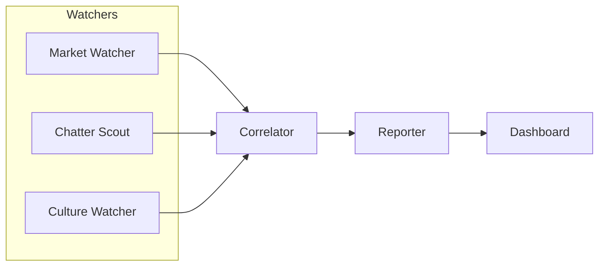

# CONTEXT.md — Drift Source of Truth

Canonical for **product decisions, non-goals, and the decisions log**. If something here conflicts with a Slack message or a verbal decision, **this file wins**; update it, don't work around it.

Not canonical for everything: [AGENTS.md](AGENTS.md) (repo root) owns the **data contract and architecture**, and [PLAN.md](PLAN.md) owns the **build clock**. The contract below is kept only as background — **build against AGENTS.md**, which handles multi-outcome markets. Where the two differ, AGENTS.md is right.

---

## Product Vision

The internet already signals what's about to be popular before the official numbers confirm it — it shows up in what people bet on and what they won't stop talking about. Drift makes that visible: it watches a prediction market and the cultural conversation feeding it side by side, and calls out the exact moment they stop agreeing — with each other, or with what actually happened.

## Problem Statement

Polymarket/Kalshi run markets on which show will be Netflix's #1 pick each week, resolving against Netflix's own published Top 10. There's no tool that checks, in the moment, whether the market's odds and the online chatter around a show agree with each other or with the eventual outcome. That comparison currently only happens in someone's head, after the fact, if they notice at all.

## Non-Goals (and why)

| Cut | Why |
|---|---|
| Real trade execution (on-chain, wallet/CLOB signing) | Real integration risk, zero judging payoff. Dashboard trades are **mocked** — logged locally, not placed. |
| Claiming to "detect market manipulation" | Overclaim a technical judge (or a real user) can poke through; real reputational/legal exposure if it implies a specific accusation. This is a **divergence signal**, not a verdict. |
| Live Netflix reveal during a live demo | The official Top 10 only updates weekly — don't build UI that assumes a live reveal happens on demand. Backtest against a chosen past week instead. |
| Coverage of real stocks/equities | No order-book/dark-pool access, same legal exposure as manipulation claims. Prediction markets only. |
| Accounts, auth, multi-user | Zero value for a single-session demo. |

---

## Architecture



- **Market Watcher** — Polymarket Gamma API (market discovery) + CLOB API (odds/price history). Optional: Kalshi public endpoints as a second market source.
- **Chatter Scout** — Grok API's X Search tool (primary, needs a funded xAI key), falling back to Google Trends (`pytrends`, free, no signup) or a news RSS feed if X access isn't available.
- **Culture Watcher** — Netflix's official Tudum Top 10 (weekly, the actual resolution source for these markets) + FlixPatrol's daily tracker (more frequent, good for a "live" feel). Neither has a formal API — both require a scraper/parser.
- **Correlator** — Grok 4.6 reasons over all three watchers' output for a given market/week, scores how well they agree, decides `aligned` vs `diverged`.
- **Reporter** — turns the Correlator's score into the plain-English explanation the UI renders. This explanation is a first-class UI element, not a tooltip — it's the answer to "why did this change / why is this recommended."

---

## Data Contracts

> **Superseded.** The live contract is in [AGENTS.md](AGENTS.md) — it handles multi-outcome markets, which these shapes do not. The shapes below are kept for context on where the fields came from. Do not build against them.

**Market Watcher output:**
```json
{
  "market_id": "string",
  "market_title": "string",
  "show_options": ["Show A", "Show B"],
  "odds_by_show": {"Show A": 0.62, "Show B": 0.38},
  "volume_24h": 12345.67,
  "timestamp": "ISO8601",
  "source": "polymarket"
}
```

**Chatter Scout output:**
```json
{
  "show": "Show A",
  "window_start": "ISO8601",
  "window_end": "ISO8601",
  "chatter_score": 0,
  "source": "x_search",
  "sample_snippets": ["optional — good for demo flavor"]
}
```

**Culture Watcher output:**
```json
{
  "week_of": "YYYY-MM-DD",
  "official_rank": ["Show A", "Show B", "Show C"],
  "source": "netflix_tudum",
  "as_of": "ISO8601"
}
```

**Correlator / Reporter output (what the UI renders):**
```json
{
  "market_id": "string",
  "week_of": "YYYY-MM-DD",
  "divergence_score": 0,
  "verdict": "aligned",
  "explanation": "plain-English string, Grok-generated — this is what the UI shows the user",
  "flagged": true
}
```

---

## Polling Cadence

| Component | Default interval | Why |
|---|---|---|
| Market Watcher (Polymarket/Kalshi) | Every **30s** | Free, no rate limit concerns — cheap to poll often, keeps the odds chart feeling live |
| Chatter Scout (X API) | Every **10 min** | X Search calls cost money — don't poll faster than the signal actually moves |
| Chatter Scout (Google Trends fallback) | Every **15 min** | Trends data itself doesn't refresh faster than this |
| Culture Watcher | Once per backtest week (or on-demand refresh) | Ground truth doesn't change intraday |
| Correlator | Event-driven — re-run whenever any watcher emits new data, with a **60s** safety-net tick | Keeps explanations current without polling unnecessarily |

All intervals are env-configurable (`MARKET_POLL_SECONDS`, `CHATTER_POLL_SECONDS`, etc.) — these are starting defaults, not hardcoded requirements.

---

## Environment Variables

| Variable | Required? | Notes |
|---|---|---|
| `XAI_API_KEY` | **Yes** | Powers the Correlator/Reporter and, if enabled, X Search |
| `X_SEARCH_ENABLED` | No (default: false) | Flip on only once the funded-key status is confirmed |
| `POLYMARKET_BASE_URL` | No | Defaults to `gamma-api.polymarket.com` / `clob.polymarket.com`, no auth needed |
| `KALSHI_ENABLED` | No | Optional second market source, public endpoints, no auth needed |
| `MARKET_POLL_SECONDS` / `CHATTER_POLL_SECONDS` | No | Override cadence defaults above |

---

## UI / Dashboard Requirements

- **Tracked markets** panel — odds-over-time chart per market
- **Themes** panel — the shows/topics being tracked and their current chatter score
- **Account & trades** panel — mocked balance, current (mocked) positions, up/down since entry
- **Explanation** — every flagged divergence and every recommendation shown in the UI must surface the Reporter's plain-English `explanation` field prominently, not just a score. This is a judging-visible requirement, not a nice-to-have — "why did this change" is the core value prop.
- **3-click trade flow**: view a tracked market → click in → click "mock trade" → confirms a logged (not real) position

---

## Decisions Log

Reasons for the calls already made, so nobody relitigates them mid-build:

- **Mock trades, not real execution** — wallet/CLOB signing is real integration risk for zero rubric payoff.
- **"Divergence signal," never "manipulation detection"** — safer claim, still an interesting demo, avoids implying a real accusation.
- **Backtest a past week, don't wait on a live Netflix reveal** — the official Top 10 doesn't refresh on hackathon-demo timescales.
- **Google Trends as the default chatter fallback** — free, zero signup, better fit for "cultural buzz" than generic news RSS.
- **Dropped scope**: real stocks/equities (access + legal risk), the other five brainstormed ideas from team planning (vibecoding-multiplayer, real estate agent, X-pain-point-finder, RCA cloud agents, spec-driven dev harness) — one project, not several, given the build window.

---

## Judging Rubric Alignment (100 pts)

| Category | Pts | What earns it |
|---|---|---|
| It works | 40 | End-to-end pipeline, tested 5x reliably before recording |
| Taste | 30 | The "market and chatter disagree" moment lands in the first 60 seconds of the demo |
| Nails a business use case | 30 | A judge can restate the problem in one sentence after one watch |

Rule compliance: Grok must be visibly doing the divergence reasoning (Correlator), not decorating a hardcoded rule — that's what keeps this inside "Cursor + Grok are load-bearing."

## Build Timeline

| Time | Milestone |
|---|---|
| 10:00–10:30 | Scope locked, repo scaffolded, every data source smoke-tested |
| 10:30–12:00 | Watchers + Correlator built in parallel against this contract |
| 12:30 | **Integration checkpoint** — all outputs flowing end to end, real or fake data |
| 1:30 | **Dry-run checkpoint** — real data, 5x reliability pass |
| 1:50 | Recording starts — stop building |
| 2:15 | Submission form filed |

## Team Split

| Feature | Owner |
|---|---|
| Market Watcher (Polymarket/Kalshi) | *(name)* |
| Chatter Scout (X API / Trends / News) | *(name)* |
| Culture Watcher (Netflix/FlixPatrol) + Correlator/Reporter | *(name)* |
| UI / Dashboard | *(name)* |

If the team is 3 people, merge Chatter Scout and Culture Watcher — both are "pull an external signal" work under one owner.
