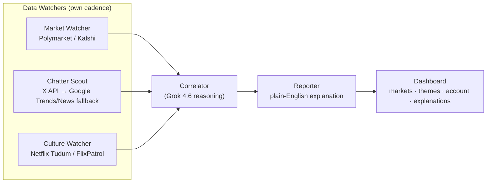

# Drift

**Prediction markets tell you what people will bet. The internet tells you what people are starting to believe. Drift flags the moment those two separate.**

Built at the Cursor Austin Grok 4.6 Hackathon, Aug 15, 2026. Path: Agentic Orchestration.

---

## The problem

Prediction markets run bets on "which Netflix show is #1" — and they resolve against Netflix's own official Top 10. But there's no quick way to see, in the moment, whether the market's odds and the online chatter about a show actually agree with each other, or whether one is calling something the other missed. Drift watches both and tells you the moment they stop agreeing.

## How it works



Three watchers pull data on independent polling cadences. The Correlator (Grok 4.6) reasons over all three signals and scores how well they agree. The Reporter turns that score into a plain-English explanation. The dashboard shows tracked markets, cultural themes, a mocked account/trade book, and — front and center — **why** each signal changed or is being recommended.

Full architecture, data contracts, and cadences: see [`CONTEXT.md`](./CONTEXT.md) (source of truth) and the rest of the docs in [`documentation/`](./documentation/README.md).

## Quick start

```bash
git clone <repo-url>
cd drift
cp .env.example .env   # fill in API keys — see CONTEXT.md for which ones are required vs optional

# backend
cd backend
pip install -r requirements.txt
python orchestrator.py

# frontend
cd ../frontend
npm install
npm run dev
```

Required for a minimal working run: nothing but Polymarket/Kalshi access (no key needed) and an xAI/Grok API key. Everything else has a free fallback — see `CONTEXT.md` → Environment Variables.

## Feature split (who owns what)

| Feature | Owner | Details |
|---|---|---|
| Data watchers (Polymarket/Kalshi, X API, Trends/News) | *(names)* | Each watcher polls its source on its own cadence — see `CONTEXT.md` |
| Correlator + Reporter | *(name)* | Grok-powered divergence scoring and explanation generation |
| UI / Dashboard | *(name)* | Tracked markets, themes, account & trades, explanation panel |

## Tech stack

Python backend (agents as independent pollers + orchestrator), Grok 4.6 API for reasoning, free/public Polymarket + Kalshi APIs, X API (or Google Trends fallback) for chatter, web frontend polling a shared JSON/SQLite store.

## Non-goals (v1)

No real trade execution (dashboard trades are logged, not placed on-chain), no live claim of "detecting manipulation" (this is a divergence signal, not an accusation), no coverage beyond Netflix/prediction markets. Full rationale in `CONTEXT.md`.

## Team

*(names, Luma emails)* — built solo/together in ~3.5 hours during the event.

## Disclaimer

This is a hackathon demo. It does not execute real trades, does not provide financial advice, and does not claim to detect real market manipulation — it surfaces a divergence signal between public data sources for research/entertainment purposes.
